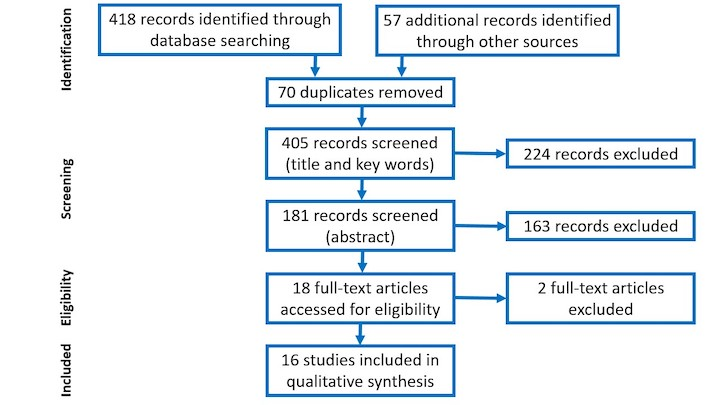

```{r setup, include=FALSE}
usethis::use_git_ignore(c("*.csv", "*.rds"))
options(htmltools.dir.version = FALSE)

library(knitr)
library(tidyverse)
library(xaringan)
library(fontawesome)
```

class: inverse, center, middle

# `r fa("fas fa-images", fill = "#fff")`

**View the slides:** 

[bretsw.com/eme6665-fs24-module4](https://bretsw.com/eme6665-fs24-module4)

---

class: inverse, center, middle

# `r fa("comments", fill = "#fff")` <br><br> Module 3 <br> Recap

---

# `r fa("comments", fill = "#fff")` Laying the Foundation

```{r, out.width = "600px", echo = FALSE, fig.align = "center"}

```

--

Purpose of finding a handbook and picking a chapter:

--

- Laying the foundation for your literature review

--

- Starting place for background, framework, and/or methods

---

# `r fa("comments", fill = "#fff")` Digging In

```{r, out.width = "600px", echo = FALSE, fig.align = "center"}
include_graphics("img/digging.jpg")
```

--

- Going deeper on your topics

--

- Looking in slightly different place, digging again

---

# `r fa("comments", fill = "#fff")` Digging Around

```{r, out.width = "600px", echo = FALSE, fig.align = "center"}

```

--

- Need to dig a lot

--

- A lot more than the 10 articles you'll identify in Modules 3 & 4

---

# `r fa("comments", fill = "#fff")` Digging Around

```{r, out.width = "600px", echo = FALSE, fig.align = "center"}

```

- No firm number... maybe more than **40-50 references**? 

--

- Maybe **15-20 pages** for all of Chapter One (Introduction, Literature Review, Framework, Purpose, and Research Questions)

---

# `r fa("comments", fill = "#fff")` Digging Around

```{r, out.width = "600px", echo = FALSE, fig.align = "center"}

```

- I had **96** references in my final dissertation (probably too many)

--

- My Chapter One was **17** pages (probably about right)

---

class: inverse, center, middle

# `r fa("fas fa-comments", fill = "#fff")` <br><br> Module 3 Practice:<br>Topic Reflection

---

class: inverse, center, middle

# `r fa("fas fa-book-open", fill = "#fff")` <br><br> Module 4:<br>Systematic Not Automatic

---

# `r fa("fas fa-book-open", fill = "#fff")` Types of Reviews

### Reading 4.2 Sutton et al. (2019)

--

- Narrative review

--

- Systematic review

--

- Meta-analysis

--

- Umbrella review

--

- Critical review

---

# `r fa("fas fa-book-open", fill = "#fff")` Types of Reviews

### Reading 4.2 Sutton et al. (2019)

- **Narrative review**

- Systematic review

- Meta-analysis

- Umbrella review

- Critical review

---

# `r fa("fas fa-book-open", fill = "#fff")` Types of Reviews

### Reading 4.2 Sutton et al. (2019)

- **Narrative review**

- **Systematic review**

- Meta-analysis

- Umbrella review

- Critical review

---

# `r fa("fas fa-book-open", fill = "#fff")` Systematic Reviews

### System ~ Gears?

```{r, out.width = "720px", echo = FALSE, fig.align = "center"}

```

---

# `r fa("fas fa-book-open", fill = "#fff")` Systematic Reviews

### System ~ Mise En Place?

```{r, out.width = "720px", echo = FALSE, fig.align = "center"}
include_graphics("img/4-mise-en-place.jpg")
```

---

# `r fa("fas fa-book-open", fill = "#fff")` Systematic Reviews

### System ~ Preparation Process

```{r, out.width = "720px", echo = FALSE, fig.align = "center"}
include_graphics("img/4-prep.jpg")
```

---

# `r fa("fas fa-book-open", fill = "#fff")` Systematic Reviews

### Systematic review ~ Intentional, structured, rigorous search

```{r, out.width = "720px", echo = FALSE, fig.align = "center"}
include_graphics("img/4-prep.jpg")
```

---

# `r fa("fas fa-book-open", fill = "#fff")` Systematic Reviews

### System ~ Preparation Process: PRISMA standards

```{r, out.width = "720px", echo = FALSE, fig.align = "center"}

```

<hr>

Staudt Willet, K. B., & He, D. (2024). Educators’ invisible labor: A systematic review. *Review of Education, 12*(2), e3473. doi:[10.1002/rev3.3473](https://doi.org/10.1002/rev3.3473)

---

# `r fa("fas fa-book-open", fill = "#fff")` Systematic Reviews

### System ~ Preparation Process: PRISMA Example

```{r, out.width = "420px", echo = FALSE, fig.align = "center"}
include_graphics("img/4-articles-intersections.png")
```

<hr>

Staudt Willet, K. B., & He, D. (2024). Educators’ invisible labor: A systematic review. *Review of Education, 12*(2), e3473. doi:[10.1002/rev3.3473](https://doi.org/10.1002/rev3.3473)

---

# `r fa("fas fa-book-open", fill = "#fff")` Systematic Reviews

### Reading 4.4 Choose-Your-Own-Adventure

```{r, out.width = "100%", echo = FALSE, fig.align = "center"}
include_graphics("img/3-cyoa-books.jpg")
```

---

# `r fa("fas fa-book-open", fill = "#fff")` Systematic Reviews

### Reading 4.4 Choose-Your-Own-Adventure

```{r, out.width = "600px", echo = FALSE, fig.align = "center"}
include_graphics("img/choose.jpg")
```

--

- Pick a **systematic literature review** relevant to your research topic

--

- Read **5 articles** cited in the review article

---

class: inverse, center, middle

# `r fa("fas fa-binoculars", fill = "#fff")` <br><br> Looking ahead

---

# `r fa("fas fa-calendar-day", fill = "#fff")` Semester schedule

- Module 1: Threads of Chapter One

- Module 2: Do You Trust Me?

- Module 3: A Handbook's Tale

- **Module 4: Systematic Not Automatic**

- Module 5: Synthesis Over Summary

- Module 6: Elements of Style (for Academic Writing)

- Module 7: Weaving Together Chapter One

---

# `r fa("fas fa-calendar-day", fill = "#fff")` Assignment: Analytic Memo

--

1. Pick **1** systematic literature review or meta-analysis article

--

2. Read **5** articles cited in the review article

--

3. Reflect on how these five studies help you view your dissertation research topic in a new way

--

  - New frameworks, new links between topics, new methods
  
--

4. Synthesize your thoughts and compose a **brief, focused memo** detailing these reflections (**400-600 words**)

--

  - Brief describe the systematic literature review

--

  - Include a 1-2 sentence summary of each article

--

  - Detail new insights gleaned from each article

--

5. Email your Analytic Memo to your dissertation chair

--

<hr>

### Once again, your main objective is **synthesis**!

---

class: inverse, center, middle

# `r fa("fas fa-question", fill = "#fff")` <br><br> Questions

<hr>

**What questions can I answer for you now?**

**How can I support you this week?**

<hr>

`r fa("envelope", fill = "#fff")` [bret.staudtwillet@fsu.edu](mailto:bret.staudtwillet@fsu.edu) | `r fa("globe", fill = "#fff")` [bretsw.com](https://bretsw.com) | `r fa("fab fa-github", fill = "#fff")` [GitHub](https://github.com/bretsw/)